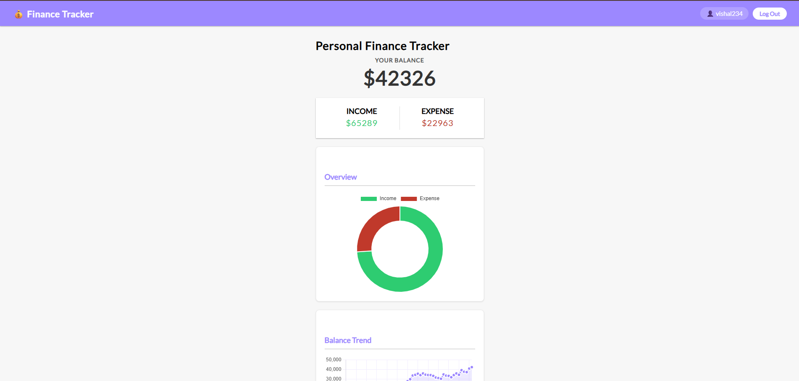
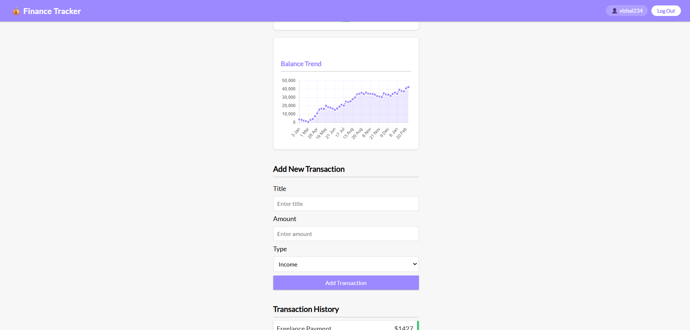
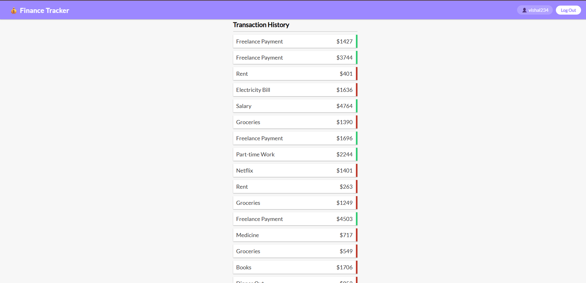

# Finance Tracker

A full-stack MERN application for tracking personal income and expenses with JWT-based authentication, transaction history, summary cards, and finance charts.

## Features

- User registration and login with JWT authentication
- Protected dashboard for authenticated users
- Add, view, update, and delete transactions
- Real-time balance, income, and expense summary
- Doughnut chart for income vs expense overview
- Line chart for balance trend visualization
- Transaction history with income and expense indicators
- MongoDB data persistence

## Tech Stack

### Frontend

- React
- React Router DOM
- Context API
- Chart.js
- react-chartjs-2

### Backend

- Node.js
- Express.js
- MongoDB
- Mongoose
- JSON Web Token
- bcryptjs

## Project Structure

```bash
finance-tracker/                    # Root project folder
│
├── Backend/                       # Express and MongoDB backend
│   ├── .env                       # Local environment variables file (setup reference, not committed)
│   ├── config/                    # Backend configuration files
│   │   └── db.js                  # MongoDB connection setup
│   ├── controllers/               # Request handling logic
│   │   ├── AuthController.js      # Register and login controller functions
│   │   └── TransactionController.js # Transaction CRUD and summary logic
│   ├── middleware/                # Custom Express middleware
│   │   ├── Authentication.js      # JWT auth protection middleware
│   │   └── errorHandler.js        # Centralized error handling middleware
│   ├── models/                    # Mongoose schemas and models
│   │   ├── transaction.js         # Transaction schema
│   │   └── user.js                # User schema
│   ├── routes/                    # API route definitions
│   │   ├── auth.js                # Auth route mappings
│   │   └── transactions.js        # Transaction route mappings
│   ├── package.json               # Backend dependencies and scripts
│   ├── package-lock.json          # Backend dependency lock file
│   ├── seed.js                    # Sample data seeding script
│   └── server.js                  # Backend entry point
│
├── frontend/                      # React frontend application
│   ├── package.json               # Frontend dependencies and scripts
│   ├── package-lock.json          # Frontend dependency lock file
│   └── src/                       # Frontend source code
│       ├── components/            # Reusable UI components
│       │   ├── Auth/              # Authentication pages
│       │   │   ├── Login.js       # Login form component
│       │   │   └── Register.js    # Registration form component
│       │   ├── DashBoard/         # Main dashboard page
│       │   │   └── Dashboard.js   # Dashboard layout and section composition
│       │   ├── Layout/            # Shared layout components
│       │   │   └── Navbar.js      # Top navigation bar
│       │   └── Transactions/      # Transaction-related UI
│       │       ├── AddTransaction.js # Form to add a new transaction
│       │       ├── Balance.js     # Balance summary display
│       │       ├── FinanceCharts.js # Doughnut and line chart component
│       │       ├── IncomeExpenses.js # Income and expense summary cards
│       │       ├── TransactionItem.js # Single transaction row item
│       │       └── TransactionList.js # Transaction history list
│       ├── context/               # Global state management
│       │   ├── AppReducer.js      # Reducer logic for transactions
│       │   ├── AuthContext.js     # Authentication context provider
│       │   └── TransactionContext.js # Transaction context provider
│       ├── services/              # API communication layer
│       │   └── api.js             # Fetch helpers for backend requests
│       ├── App.css                # Global application styling
│       ├── App.js                 # Main frontend app component
│       └── index.js               # React app entry point
│
├── .gitignore                     # Ignored files and folders
└── README.md                      # Project documentation
```

## API Endpoints

| Method | Endpoint | Description | Access |
|--------|----------|-------------|--------|
| POST | `/api/auth/register` | Register a new user | Public |
| POST | `/api/auth/login` | Login a user | Public |
| GET | `/api/transactions` | Fetch all transactions | Private |
| POST | `/api/transactions` | Add a transaction | Private |
| GET | `/api/transactions/:id` | Fetch a transaction by ID | Private |
| PUT | `/api/transactions/:id` | Update a transaction by ID | Private |
| DELETE | `/api/transactions/:id` | Delete a transaction by ID | Private |
| GET | `/api/transactions/summary` | Fetch income, expense, and balance summary | Private |

## Getting Started

### Prerequisites

- Node.js
- npm
- MongoDB Atlas account or local MongoDB instance

### 1. Clone the repository

```bash
git clone https://github.com/Vishalkrishna3434/finance-tracker.git
cd finance-tracker
```

### 2. Set up the backend

```bash
cd Backend
npm install
```

Create a `.env` file inside `Backend/` with the following values:

```env
PORT=5000
MONGO_URI=your_mongodb_connection_string
PROCESS_TOKEN_SECRET=your_jwt_secret
NODE_ENV=development
```

Start the backend server:

```bash
npm run server
```

The backend runs on `http://localhost:5000`.

### 3. Set up the frontend

Open a new terminal and run:

```bash
cd frontend
npm install
```

Start the frontend:

```bash
npm start
```

The frontend runs on `http://localhost:3000`.

## Configuration Notes

- The frontend API base URL defaults to `http://localhost:5000/api`.
- If needed, you can override it by setting `REACT_APP_API_URL` in the frontend environment.
- Make sure both frontend and backend are running at the same time.

## Application Flow

1. Users register or log in from the frontend.
2. The backend validates credentials and returns a JWT token.
3. The token is stored in local storage.
4. Authenticated requests use the token to access protected transaction routes.
5. The dashboard shows summaries, charts, and transaction history based on saved data.

## Screenshots

### Dashboard Overview



### Balance Trend and Add Transaction



### Transaction History




## Future Improvements

- Filter transactions by type or date
- Category-based transaction support
- Monthly reports and analytics
- Export transactions to CSV
- Improved mobile responsiveness
